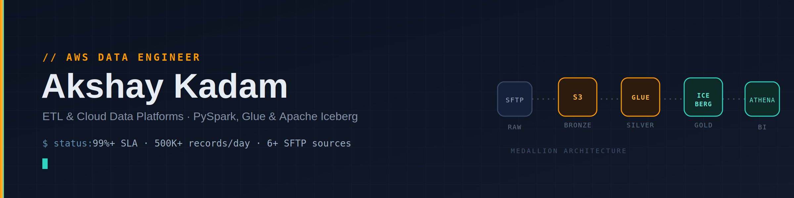

# Hello! Welcome to my Portfolio 

# Akshay Kadam — AWS Data Engineer

## 🧭 About Me

- AWS Data Engineer with **2+ years** at HTC Global Services.
- Focused on building cloud-native ETL/ELT pipelines and data platforms using PySpark, Apache Iceberg, and AWS-managed services.
- Strong ownership across design, implementation, monitoring, and cost optimization for production data systems.

## 💪 Key Strengths

- Pipeline architecture & orchestration
- Data lake design (medallion architecture)
- Cost optimization and Glue/compute tuning
- SLA monitoring and observability (CloudWatch, alerts)

## ⚙️ Tools & Technologies

- AWS: S3, Glue, Lambda, Step Functions, EventBridge, RDS, Athena, CloudWatch, SNS, SQS, Secrets Manager, DynamoDB, Transfer Family (SFTP)
- Data: PySpark, Apache Iceberg, dbt, Parquet, Medallion Architecture
- Dev & Infra: Terraform, GitLab CI/CD, Git
- Languages: Python, SQL

## 🚀 Featured Projects

### Enterprise Batch Data Lake

- Objective: Ingest batch files from external SFTP sources into a curated data lake for analytics.
- Skills demonstrated: Large-scale PySpark ETL, Glue/EC2 job orchestration, SLA-driven monitoring, data cataloging.
- Tools used: PySpark, AWS Glue, EventBridge, Step Functions, Lambda, S3, Glue Data Catalog, Athena, SNS, CloudWatch.
- Key results: Processed **500K+ records/day** across 6+ SFTP sources; exposed curated datasets via Athena; maintained **99%+ SLA** with automated alerts and dashboards.
- Project link: (replace with repo or deployment URL)

### Cloud-Native API & Iceberg Platform

- Objective: Build ELT platform to ingest REST API data into RDS and transactional Iceberg tables with schema evolution.
- Skills demonstrated: API ingestion, secure credential management, schema evolution, dbt transformations, cost tuning.
- Tools used: AWS Lambda, Step Functions, Secrets Manager, RDS, S3, Apache Iceberg, dbt, Glue, Athena, Terraform.
- Key results: Enabled time-travel and ACID semantics with Iceberg, implemented Secrets Manager auth and dbt models, reduced Glue DPU costs through tuning.
- Project link: (replace with repo or deployment URL)

## 📫 Let's Connect

- Email: akshaykadam0262@gmail.com
- LinkedIn: https://www.linkedin.com/in/akshay-kadam-3a2771215/
- GitHub: https://github.com/kadamAK0262
- Bold Pro: https://bold.pro/my/akshay-kadam-251104141212?vsid=1b88c4c4-b142-47c9-bc67-a16e0cf6dcfe

---

Confident, concise, and production-focused — always aiming for reliable, cost-effective data platforms.
